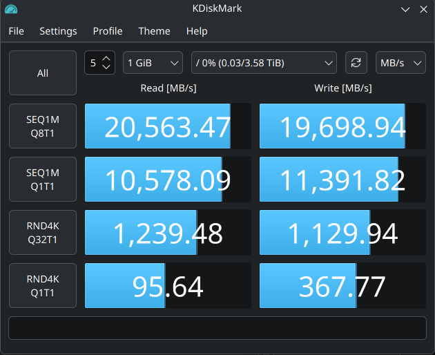

<div align="center">

# ⚡ rcraid

</div>

[](https://github.com/joeytroy/amd-raid-driver/actions/workflows/ci.yml)
[](LICENSE)
[](#quick-start)
[](#benchmarks)
[](#for-developers)
[](https://www.paypal.com/paypalme/joeytroynm)

Your RAIDXpert array becomes an ordinary block device at `/dev/rcraid0` —
partition it, format it, mount it, benchmark it, and **boot Linux straight
from it**.

[Quick start](#quick-start) <br>
[Supported hardware](#is-my-hardware-supported) <br>
[Benchmarks](#benchmarks) <br>
[Safety](#safety-first) <br>
[Roadmap](#not-yet-supported) <br>
[Contributing](#for-developers) <br>


---

> ⚠️ **First time?** Read [Safety first](#safety-first) before loading the
> driver — the AMD chipset makes *every* NVMe in the box look like an array
> member, including your OS disk.

## At a glance

| | |
|---|---|
| **RAID levels** | RAID0 ✅ &nbsp;·&nbsp; RAID1 ✅ &nbsp;·&nbsp; RAID10 🗺️ roadmap &nbsp;·&nbsp; RAID5 ❌ not planned |
| **Boot from the array** | ✅ Validated on hardware for **both** levels — installer script, DKMS rebuilds, initramfs hook, UEFI fallback entry |
| **Throughput** (2× T700, PCIe 5.0) | RAID0 **19.7 / 18.7 GB/s** · RAID1 **20.5 / 11.1 GB/s** (seq R/W — [details](#benchmarks)) |
| **Filesystem safety** | FLUSH · FUA · DISCARD/TRIM — `fsync`, journaling, and `fstrim` behave correctly |
| **Kernel** | ≥ 6.15 (Ubuntu 24.04: the HWE stack, 6.17+) |
| **Metadata** | 100 % read from the on-disk RAIDXpert config — nothing hardcoded |
| **License** | GPL-2.0-only, clean-room under DMCA §1201(f) — aiming for mainline |

---

## Is my hardware supported?

**Yes, if you have an AMD-RAID NVMe array** on any recent AMD platform —
Ryzen 7000+, Ryzen AI 300 / AI Max, Threadripper 7000 / 9000 (TRX50 /
WRX90), or the X870 / B850 / X670 / B650 chipsets. They all present the
NVMe RAID controller as PCI `1022:B000`, which is fully implemented here.

| PCI ID | Controller | Status |
|--------|-----------|--------|
| `1022:B000` | NVMe RAID Bottom (TRX50, WRX90, X870/X670, B850/B650, …) | ✅ **RAID0 + RAID1 read/write, boot-from-array validated** |
| `1022:43BD` `7905` `7916` `7917` | SATA RAID (Promontory / older) | ⚙️ Claimed but stubbed — not yet implemented |

> **Heads-up for RAID1 users:** degraded mode is **not implemented yet** —
> a member failure downs the volume (your data stays safe on both drives,
> but availability goes with it). Details under
> [Not yet supported](#not-yet-supported).

---

## What works today

- **Metadata-native assembly.** Member count, member order, stripe
  size, RAID level, and capacity all come from the on-disk RAIDXpert
  metadata — read from the **committed** config generation, so a
  previously deleted array on the same disks can never be assembled by
  mistake. Nothing is hardcoded.
- **RAID1 mirrors done right.** Reads round-robin across both members
  (~2× single-drive throughput); writes and discards fan out to every
  mirror and complete only when the *last* member acknowledges — an
  `fsync` can never pass while one mirror holds stale data.
- **Boot Linux from the array.** Validated end to end for both levels:
  Kubuntu 24.04 (HWE kernel 6.17) installed onto and booting from a
  2× Crucial T700 array — as RAID0 and, separately, as RAID1 — with DKMS
  rebuilds and an initramfs hook that brings the array up before
  `pivot_root`.
- **Filesystem-safe.** FLUSH, FUA, and DISCARD/TRIM are all wired up,
  so `fsync`, journaling, and `fstrim` behave correctly.
- **Fast — and true to each RAID level's physics.** Interrupt-driven
  async completion with a scatterlist-native DMA path: the hardware reads
  and writes your pages directly, no bounce buffers, no memcpy. Numbers
  below.
- **Resilient.** 30 s command timeouts, controller health tracking,
  best-effort NVMe Abort, and automatic controller reset on the first
  timeout — with a manual sysfs reset as a fallback.

Writes are **off by the module's default** (`enable_writes=1` to opt in) —
the `install-livecd.sh` and DKMS installers turn writes on for you; the
read-only default only applies to a bare manual `insmod`.

---

## Benchmarks

KDiskMark 3.3.0 on `/dev/rcraid0` — 2× Crucial T700 (PCIe 5.0) on a TRX50
motherboard. The RAID1 run was measured **booted from the mirror**, with
the array serving `/`.

| SEQ1M Q8T1 | RAID0 | RAID1 |
|---|---:|---:|
| **Sequential read** | 19.7 GB/s | **20.5 GB/s** |
| **Sequential write** | 18.7 GB/s | 11.1 GB/s |
| **Random 4K read (Q32)** | — | 281 K IOPS |
| **Random 4K write (Q32)** | — | 256 K IOPS |

Why the numbers look the way they do: RAID1 **reads** beat even RAID0
because both mirrors serve reads in parallel with no stripe-boundary
splits; RAID1 **writes** are bounded by a single drive because every
write must land on both mirrors — that's the mirror contract, not
overhead.

<p align="center">
  <br>
  <em>KDiskMark 3.3.0 on <code>/dev/rcraid0</code> — RAID0 across two Crucial T700 NVMe SSDs (PCIe 5.0) on a TRX50 motherboard.</em>
</p>

---

## Safety first

Two things protect your data and your OS install. Understand both:

1. **The driver is read-only unless writes are enabled with
   `enable_writes=1`.** The install scripts enable writes for you; a bare
   manual `insmod` stays read-only. On the manual path, do your first run
   read-only and confirm the array assembles correctly before enabling
   writes.

2. **Your OS drive can masquerade as an array member.** The AMD chipset
   shadows every NVMe as PCI `1022:b000`, including your boot SSD. The
   driver refuses to touch a disk whose `subsystem_vendor` doesn't match
   the array (the `safe_subsys_vendor` parameter), and the install
   scripts set this for you — but if you bind drives by hand, **never
   unbind your OS drive.** Identify members by their `Subsystem:` line
   (Crucial vs. Samsung vs. WD, etc.).

Also note: the module is **unsigned**, so **Secure Boot must be off**
(or you sign the module yourself and enrol the key — see `INSTALL.md`).
Both installers check this up front and tell you exactly what to do.

---

## Quick start

**Prerequisites**

- BIOS in RAID mode, array already created in RAIDXpert (see `INSTALL.md`
  for the one-time BIOS setup).
- Secure Boot disabled.
- Kernel **≥ 6.15** (on Ubuntu 24.04 that means the HWE stack, 6.17+ —
  the 6.8 GA kernel is too old).
- `sudo apt install build-essential linux-headers-$(uname -r)`

Pick the path that matches what you're doing:

### 🅐 Install Linux *onto* the array (from a live USB)

This is the recommended path for a fresh array. `install-livecd.sh` runs
in two phases around the normal OS installer — you don't reboot until the
very end. Full walkthrough:

**1. Boot the live USB and enter the live desktop.**
Flash a stock Ubuntu / Kubuntu / Debian / Fedora ISO, boot it, and choose
**Try** (the live session) — *not* Install yet. Connect to the network.

**2. Build and load the driver.**

```sh
sudo apt install -y git          # or: sudo dnf install -y git
git clone https://github.com/joeytroy/amd-raid-driver.git
cd amd-raid-driver
sudo ./install-livecd.sh
```

The script installs build tools, compiles the module against the live
kernel, auto-detects your array members, binds them, and loads `rcraid`.
When it prints that **`/dev/rcraid0` is up**, it pauses and waits for you.

**3. Run the OS installer — leave this terminal open.**
Launch the distro's installer from the live desktop (*Install Kubuntu*,
etc.) and:

- ✅ **Tick "Download updates while installing."** Keep the machine online
  for the whole run — in our testing this is what keeps the installer from
  restarting the session and dropping the loaded driver (and the array)
  partway through the install.
- Point the install at **`/dev/rcraid0`**. The simplest option is
  **"Erase disk and install"** with `/dev/rcraid0` selected as the target
  — the installer auto-partitions it and phase 2 picks up the result. (Use
  Manual/Custom instead only if you want a specific layout.) Just make sure
  the disk you erase is `/dev/rcraid0`, **not** your OS drive or the live
  USB.
- Let it finish, but when it offers to reboot, **do *not* reboot.** Close
  the installer and return to the terminal.

**4. Press Enter to finish.**
Back in the terminal, press Enter. Phase 2 finds your new rootfs on
`/dev/rcraid0pN`, chroots in, installs DKMS + the initramfs hook against
the *target* kernel, and writes a UEFI boot entry (plus an
`\EFI\BOOT\BOOTX64.EFI` fallback, since installer-created entries often
don't stick on RAIDXpert firmware).

**5. Reboot.** `sudo reboot` — the system now boots from the array on its
own. If the first boot misbehaves, hit `e` in GRUB and add
`rd.driver.blacklist=nvme` to prove the rcraid path, then revert.

### 🅑 Mount an array from an existing Linux install (DKMS, persistent)

Survives kernel updates and comes up automatically at every boot:

```sh
sudo apt install dkms
sudo ./install-dkms.sh
```

It detects your array members (vs. your OS drive), installs the module
via DKMS, pins the members to the driver with a udev rule, enables writes
by default, and adds an initramfs hook. Reboot and `/dev/rcraid0` (plus
any `/dev/rcraid0pN` partitions) is just there. `sudo ./uninstall-dkms.sh`
reverses all of it.

### 🅒 Build and load by hand (dev iteration / one-off)

<details>
<summary>Manual unbind / insmod steps</summary>

```sh
sudo ./build.sh                        # produces rcraid.ko

lspci -d 1022:b000 -k                   # find your members' BDFs
                                        # ⚠️ do NOT include your OS drive

# Unbind each array member from nvme:
echo 0000:81:00.0 | sudo tee /sys/bus/pci/drivers/nvme/unbind
echo 0000:82:00.0 | sudo tee /sys/bus/pci/drivers/nvme/unbind

sudo insmod ./rcraid.ko                 # read-only (safest first run)
sudo insmod ./rcraid.ko enable_writes=1 # read-write

# Confirm it came up:
sudo dmesg | grep -E 'rcraid|rc_volume' | tail -20
lsblk /dev/rcraid0
```

Then format/mount as any disk, e.g. a fresh whole-disk XFS:

```sh
sudo mkfs.xfs -f -d su=256k,sw=<num_members> /dev/rcraid0
sudo mount -o noatime /dev/rcraid0 /mnt/rcraid0
```

Unload with `sudo umount … && sudo rmmod rcraid`. Note the manual path
must be repeated every reboot (path 🅑 automates it), and after `rmmod`
the drives stay unbound until you rebind them to `nvme` or reboot.

</details>

Full setup, troubleshooting, and the Secure-Boot / signing details are in
**[`INSTALL.md`](INSTALL.md)**.

---

## Not yet supported

- **RAID1 degraded mode / rebuild** — ⚠️ **know this before trusting the
  mirror**: today a member failure fails the whole volume (same behavior
  as RAID0) instead of serving from the surviving mirror. Your data is
  still duplicated on both drives — nothing is lost — but the volume
  goes down until the array is healthy again. Degraded-mode operation,
  hot-plug handling, and background rebuild are the next roadmap items.
- **RAID10** — roadmap. **RAID5** — not planned (AMD only supports it on
  3rd-gen Threadripper).
- **SATA RAID** — the `43BD / 7905 / 7916 / 7917` controllers are claimed
  but the AHCI path is a stub.
- **No array management** — create/modify the array in BIOS/RAIDXpert.
- **No Secure Boot signing** out of the box.
- **No retry of transient NVMe errors** — a failed command surfaces as an
  I/O error (`BLK_STS_IOERR`) even when the drive reports it as retryable
  (DNR=0); it isn't re-dispatched. Controller-level failures still trigger
  the automatic reset described above.
- **Single-request multi-stripe fan-out is intentionally disabled** —
  requests are split at stripe boundaries (`chunk_sectors`), so each NVMe
  command targets exactly one member. Parallelism across members comes from
  many requests in flight at once (which is what the numbers above measure),
  not from one request fanning out. The fan-out path is wired up but
  unreachable by design — see
  [`docs/IMPLEMENTATION.MD`](docs/IMPLEMENTATION.MD).

The prioritized checklist lives in
[`docs/IMPLEMENTATION.MD`](docs/IMPLEMENTATION.MD).

---

## For developers

This is a clean-room driver reverse-engineered from AMD's publicly
distributed Windows binaries under DMCA §1201(f) interoperability
protections — **no AMD source code is used**. Contributions welcome:
open a PR, add yourself to the contributor list, and sign off your
commits (`git commit -s`). The long-term goal is mainline kernel
inclusion.

Every PR is gated by CI that not only builds against three kernel
lines but **boots the driver in QEMU** against synthetic RAID0 and
RAID1 arrays (`scripts/qemu-test/`). The synthetic metadata is
deliberately booby-trapped with the failure modes found during
hardware validation — a stale deleted-array config generation, a raw
single-disk record with a matching DeviceID — and the guest battery
covers write/readback, module reload cycles, discard+rewrite, and a
real `mke2fs` run (sub-page buffered writeback, the I/O pattern that
page-aligned tests can never generate).

| Doc | What's in it |
|-----|--------------|
| [`docs/STATUS.md`](docs/STATUS.md) | Current state, implementation history, and the timeout / reset / dead-controller design |
| [`docs/IMPLEMENTATION.MD`](docs/IMPLEMENTATION.MD) | Prioritized checklist toward a daily-driver release |
| [`docs/REVERSE_ENGINEERING.md`](docs/REVERSE_ENGINEERING.md) | RE reference — Windows-driver findings, geometry, and remaining unknowns |
| [`docs/RE_METHODOLOGY.md`](docs/RE_METHODOLOGY.md) | Clean-room process and legal record |

**Repository layout**

| Path | What's there |
|------|--------------|
| `rc_*.c`, `rc_*.h` | The driver (SPDX `GPL-2.0-only`) |
| `Makefile`, `build.sh`, `test_driver.sh`, `bench.sh`, `unload.sh` | Build + test helpers |
| `scripts/qemu-test/` | QEMU functional-test rig: synthetic firmware-faithful metadata (`mkmeta.py`) + guest test battery, run by CI on every PR |
| `docs/` | Status, open questions, Ghidra findings, decompiled extracts |
| `drivers/` | *(removed from the tree)* AMD Windows binaries + Linux SDK used as RE input — vendor-distributed material, never compiled in. Retrievable from git history: `git checkout 69738ee -- drivers/`, or from AMD's public download pages |
| `scripts/ghidra/` | Headless-Ghidra extraction scripts |

---

## License

**GPL-2.0-only** — see [`LICENSE`](LICENSE). Maintained by Joey Troy
(`@joeytroy`).

The PCI IDs, on-disk metadata layouts, and protocol behaviour are derived
from analysis of AMD's publicly distributed Windows drivers
(`rcbottom.sys`, `rcraid.sys`, `rccfg.sys`) under DMCA §1201(f). No AMD
source is incorporated.

### A note for AMD

This is an interoperability driver for hardware you sold, so Linux owners
can access their own data. It doesn't redistribute your binaries beyond
what the dev team needs as reference, and it doesn't link against your
proprietary core. We'd be glad to coordinate on documentation or hardware
references — please open an issue.
